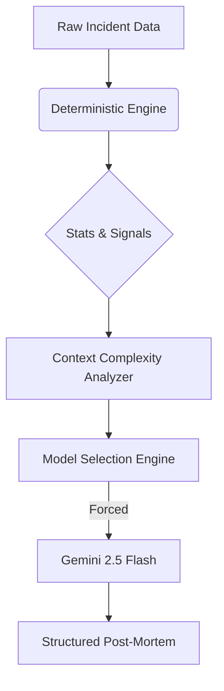

# Post-Mortem Generator

A production-grade SRE Incident Analysis platform that combines **Deterministic Signal Extraction** with **Generative AI** (Gemini 2.5 Flash) to produce accurate, defensible, and structured post-mortems.

## 🚀 Key Features

*   **Dual-Layer Architecture**:
    *   **Deterministic Engine**: Extracts hard facts (Timeline, Log Patterns, Metric Breaches) using Regex and Threshold logic.
    *   **Generative AI**: Synthesizes facts into a coherent narrative using **Gemini 2.5 Flash**.
*   **Resilience & Security**:
    *   **Global Rate Limiting**: Limit of 5 requests/minute globally to prevent abuse.
    *   **Timeouts**: 30-second strict timeout on LLM calls.
    *   **Mock Mode Fallback**: Gracefully degrades to a simulated response if API keys are missing or services fail.
*   **Engineering-First UI**:
    *   Visual Timeline & Metric Inspectors.
    *   Clear separation of "What we Know" vs "AI Hypothesis".
    *   "Humorous Take" section for team morale.

## 🎥 Demo Video

*(Include your demo video link here)*

## 🛠️ Architecture



## ⚡ Setup & Run

### Prerequisites
*   Node.js v14+
*   npm

### Installation

```bash
# Install root dependencies
npm install

# Install Client & Server dependencies
cd client && npm install
cd ../server && npm install
```

### Configuration
Create a `.env` file in `server/` (see `server/.env.example` if available, otherwise use this template):

```env
# Gemini API Key (Required for AI)
GEMINI_API_KEY=your_gemini_key_here
GEMINI_MODEL=models/gemini-2.5-flash

# (Optional) Hugging Face - Currently disabled
HF_API_KEY=...
HF_MODEL=...
```

### Running the App

1.  **Start Backend** (Port 3001):
    ```bash
    cd server
    node src/index.js
    ```

2.  **Start Frontend** (Port 5173):
    ```bash
    cd client
    npm run dev
    ```

3.  Open `http://localhost:5173` in your browser.

## 🧪 Testing

To verify API keys and connectivity without the UI:

```bash
cd server
node scripts/test_keys.js
```

## ⚠️ Design Decisions
*   **No Database**: Data is stored in filesystem/memory for portability.
*   **Strict JSON Schema**: The LLM is forced to output valid JSON to ensure UI consistency.
*   **Provenance**: All AI outputs are signed to ensure transparency (`[Generated by models/gemini-2.5-flash]`).
